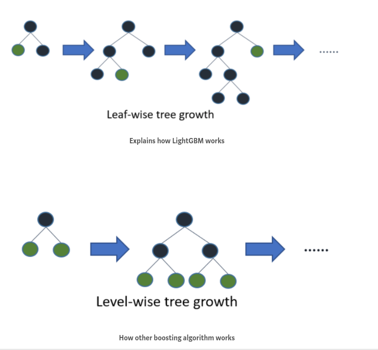

# LightGBM

Unsurprisingly, LightGBM is a kind of Gradient Boosting Machine.

## What makes it unique?

Something called *leaf-wise growth*, as opposed to *level-wise growth*, which is the usual thing. This diagram explains it very well.

In words: it chooses the best-looking leaf to split from and only splits there.

## What are the benefits?

It requires less memory to run and is faster. I suppose this is because it is limiting the calculations it allows itself to do.

## Tradeoffs?

It's prone to over-fitting, and also the speed doesn't matter as much on small datasets so why bother? Apparently a rule of thumb is only to use LGBM on datasets with 10,000+ rows.