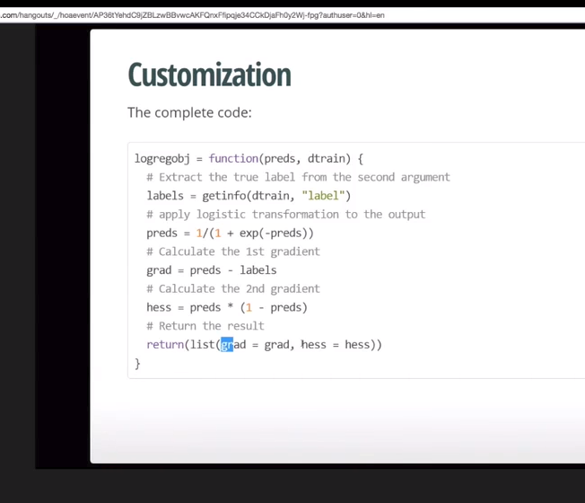

# XGBoost Algorithm (Extreeme Gradient Boosting)

it uses gradient to calculate the next step to take each time.

It also calculates the *second order* gradient, not just first (second derivative). 

ALl splits are made based on "greater-than" conditions.

predictions are made (for sample `x`) as follows:
1. build the tree
2. apply `x` to the tree, `x` will end up on a leaf
3. use some information in that leaf to predict some fact about `x`

all samples assigned to a given leaf will be given   *exactly* the same score

How exactly do we assign this score though (i.e. what is the exact relation between a leaf and the score assigned to any samples that fall into it)? We *could* just use the mean. I.e. the mean of the leaf for a given attribute is the predicted score for that attribute for any samples put into the leaf. 

BUT, it turns out, if you do some fancy maths, you can actually find the *optimal* relation. It's much more complex than a mean sadly, so im not going to explain it. Point is though: we can know for sure using maths how to go from a leaf to a prediction.

## Deciding how to make splits? ("how to find a good tree structure")

Two sub-questions:

1. When to split (i.e., when to stop splitting)
2. how to split (how, specifically, to partition leaves into further leaves)

### How to split

This is how XGBOOST does it:

For each feature:

1. sort the leaf according to that feature
2. find all the possible splitting points (thresholds) for that feature
3. for each split point, see which subsequent leaves reduce the objective the most

Whichever feature has the greatest objective reduction (I think we use the target labels for this) split is the feature we choose to split (and we split it at that point). More specifically, there is a function `f(leaf) = y` that maps from leaves to an objective score. We will choose a split that maximizes:

    0.5 * [f(new_leaf_1) + f(new_leaf_2) - f(old_parent_leaf)] - regularization

I.e. the split that improves the overall objective score the most, keeping in mind regularization (since we just added a new leaf, so the tree complexity  increased).

Usually in GBM you split based on information gain, so this splitting method is unique to xgboost.

But in fact what happens is the user sets a `max_depth`, and xgboost makes a tree of that size, always splitting as above. Then it goes back and *prunes* any branch pairs with negative gain (again as calculated above).

## Hyperparameters

 `gamma`: minimum loss reduction required to allow a split (i.e. minimum improvement required not to prune a branch). 

 `min_child_weight`: minimum number of samples that must be in a leaf before we consider splitting it

 `max_delta_step`: maximum update amount per tree. In GMB we create corrective trees which predict how badly the former tree was, and then generate a new tree which is just the difference of predictive and former trees. `eta` or `learning_rate` adds some regularization by reducing each update (more updates cancel noise hopefully). But sometimes we end up with huge steps anyway (can't think of any examples) and multiplying them by a constant still leaves us with too large of a step. To prevent any step from being too large, we can put an **absolute** cap on the size of a step. This cap is called `max_delta_step` in xgboost. 

 ## Tuning

 Things to look out for:
 - over-fitting
 - imbalanced classes

 Trust your own CV more than the public LB. Usually you can cross-validate with more data than public LB gives you.

 ### To force simpler models:

 max_depth, min_child_weight, gamma

 ### To handle noisy data

 subsample, colsample_by_tree

 ## Imbalanced classes

 If you only care about prediction rank:
 - `scale_pos_weight` to normalize input values around 0
 - `auc` evaluation metric

 If you care about the prediction value:
 - Set parameter `max_delta_step` to something (maybe 1) 

 ## Custom loss function

 