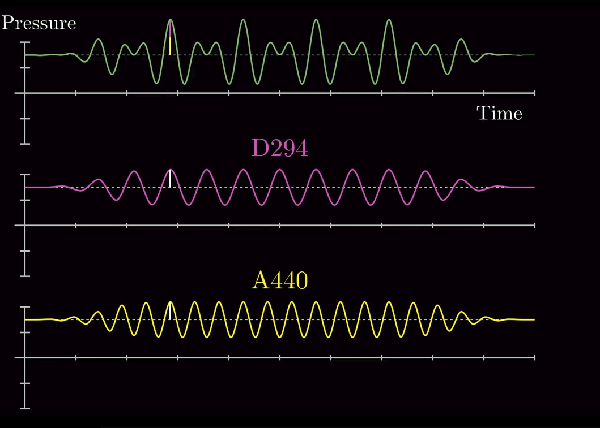
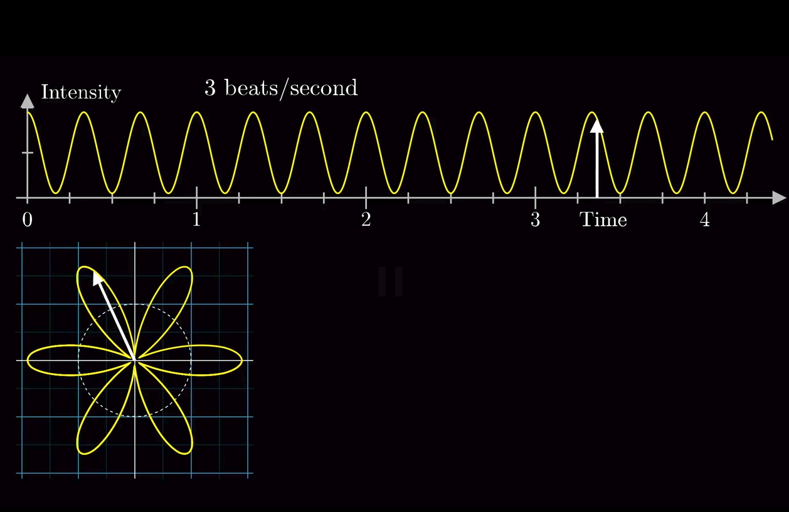
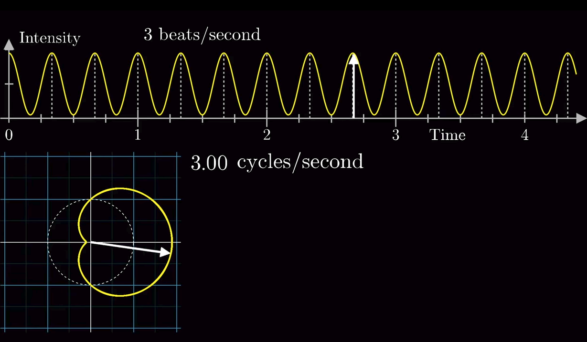
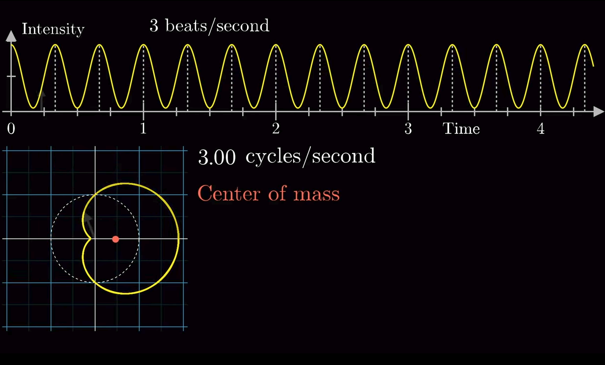
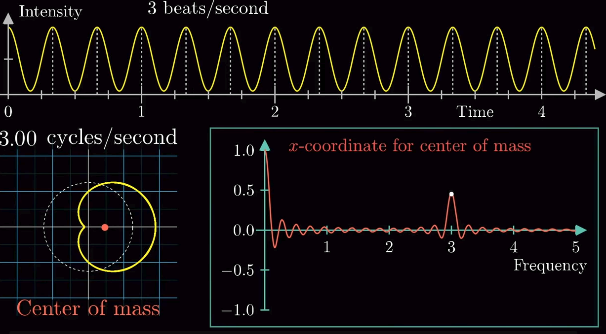
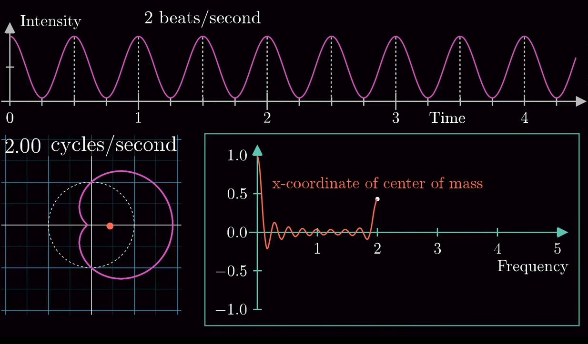
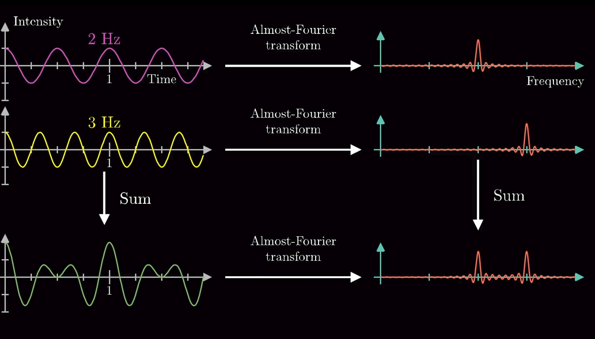

# Fourier Transform

It's important.

## Sound

Here is how sound works:

1. Air has pressure. 
2. Air pressure can fluctuate. 
3. These fluctuations are thought of as waves and can be graphed.
4. Our ears can pick up these waves. That's what sound is.

Higher tones have a greater frequency (smaller distance between graph peaks).

If you play two different notes at once the pressure generated by each accumulates, so when the two frequencies both peak you get a very high pressure indeed.

All we ever get with our ears or a microphone is the "sum" of all the frequencies, i.e. the total air pressure at any given point in time.

### Question:

Given a recording that only has this sum pressure measure, how do we decompose it into its component frequencies?

### Answer:

This is not easy. Let's make a start.

1. Take a wave function, and wrap that wave function around the center-point of a graph.

So: 

1. Choose a random direction vector.
2. Scale it by the first x and y from your original graph
3. Update the vector a little so that it's a bit further clockwise than the original vector.
4. Go back to 2, unless you've reached the original vector.

An important factor here is how much to update the vector each time, or rather, how much of the original graph you want to capture on this new circular graph. In particular, if you set this **winding frequency** so that a single rotation of the circular graph captures a single peak-trough cycle of the initial frequency:

Imagine now that the circular graph was made up of actual matter, like a thin wire, and we calculated, for every possible circular graph, where it's center of mass would be. Often, this center of mass would be very close to the center of the graph, as the peaks and valleys of our frequency tend to spread themselves around the circle pretty evenly.

However, we can clearly see that when we sync the graph so that one revolution of the graph captures a single peak-trough cycle, the center of mass would be offset from the center by a fair margin.

Graphing this "center-of-mass" (in this case only along the x coordinate) against the winding frequency (expressed in terms of "winds per second") would produce something like this:

This mass-graph is coming close to a fourier transform (of the original frequency I guess).

#### Why tho?

OK, so think about it. This frequency, which has 3 cycles per second, is going to peak at a winding frequency of 3 winds per second. A lower frequency, say with 2 cycles per second, is going to peak at a lower winding frequency, of like, 2 winds per second.

Sooooooo: I guess if you have a frequency which is the sum of many sub-frequencies, then you can just graph it's center of mass and wherever you get a peak, that corresponds to the cycles-per-second of a sub frequency. And you can also invert this process, getting a frequency from a mass graph. So to remove a bad frequency you'd make the mass graph, smoosh the bad peak, and invert the new mass graph to get your cleaned signal.

OK, cool. Another important fact: if you graph the center-of-mass of two frequencies, `a` and `b` and then sum these two graphs, you get *exactly the same graph* as if you summed `a` and `b` to get a new frequency `c` and then graph `c`'s center of mass.

### Formalizing

We got close to what a fourier transform before. But what actually is a fourier transform?

#### e

So Euler, clever dude, came up with a number called `e`, after him. When you multiply this number by another fun irrational number number, `i`, and a third, variable number `x`